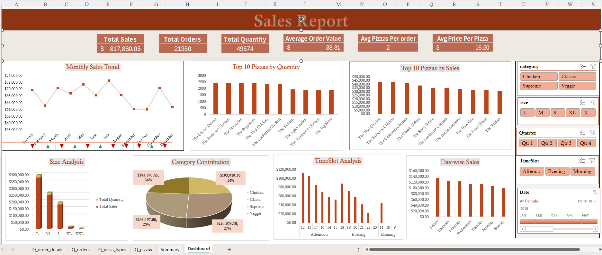
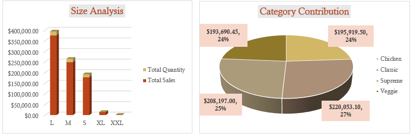
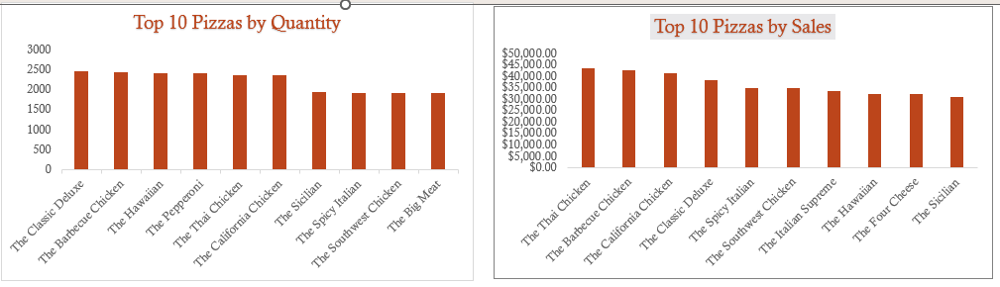
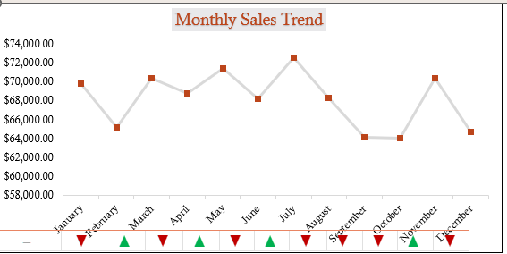

# Pizza Sales Analysis

## Project Overview

This project analyzes pizza sales data using Microsoft Excel to understand revenue performance, product popularity, and customer purchasing behavior.

The analysis focuses on identifying top-selling pizzas, evaluating sales performance by category and size, and analyzing sales trends over time. The insights are presented through an interactive Excel dashboard built using Power Pivot, Pivot Tables, and Pivot Charts.

## Business Problem

Restaurants generate large volumes of sales data every day. Without proper analysis, it is difficult to determine which products generate the most revenue and which items require improvement.

This project transforms raw pizza sales data into meaningful insights using Excel’s data modeling and visualization tools to support data-driven business decisions.

## Project Objectives

- Analyze total revenue, total orders, and total pizzas sold
- Identify top-selling and least-selling pizzas
- Evaluate sales performance by pizza category and size
- Analyze sales trends across days and months
- Provide insights to support menu optimization and sales strategies

## Tools Used

Microsoft Excel
Power Query – Data cleaning and transformation
Power Pivot – Data modeling and relationships
DAX – Creating calculated measures and KPIs
Pivot Tables – Data aggregation and analysis
Pivot Charts – Interactive data visualization

## Skills Demonstrated

This project demonstrates several key data analytics skills:

### Data Cleaning & Transformation
Used Power Query in Excel to clean raw data, handle missing values, and prepare the dataset for analysis.

### Data Modeling
Built a structured data model using Power Pivot to manage relationships and enable efficient analysis.

### Data Analysis using DAX
Created calculated measures such as Total Revenue, Total Orders, Total Pizzas Sold, and Average Order Value using DAX formulas.

### Business Performance Analysis
Analyzed product performance, sales distribution by category and size, and revenue contribution of different pizzas.

### Data Visualization
Developed an interactive dashboard using Pivot Tables and Pivot Charts to present insights clearly.

### Insight Generation
Identified key sales trends, top-performing products, and opportunities to improve menu performance.

## Dashboard Features

- KPI indicators for Total Revenue, Total Orders, Total Pizzas Sold, and Average Order Value
- Sales performance analysis by pizza category and size
- Identification of top-selling and lowest-performing pizzas
- Daily and monthly sales trend analysis
- Interactive dashboard using Pivot Tables and Pivot Charts

## Dashboard Preview

### Sales Overview

### Category and Size Performance

### Top Selling Pizzas

### Sales Trends

## Key Insights

- A small number of pizzas contribute significantly to total revenue.
- Large-sized pizzas generate higher revenue due to higher pricing and demand.
- Certain pizza categories consistently outperform others in sales.
- Sales fluctuate across different days and months.

## Recommendations

- Promote top-performing pizzas through targeted marketing campaigns.
- Review low-performing items for potential menu improvements.
- Use sales trends to plan promotions and inventory management.
- Focus on popular pizza sizes and categories to maximize revenue.

## Project Structure

Pizza-Sales_Analysis

├── data – dataset used for analysis

├── powerbi – Excel dashboard file

├── screenshots – dashboard preview images

├── presentation – project presentation slides

└── README.md – project documentation

  
